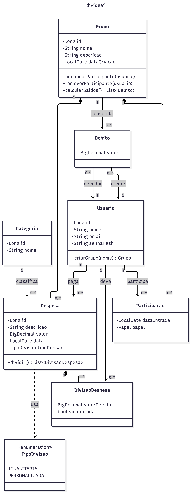
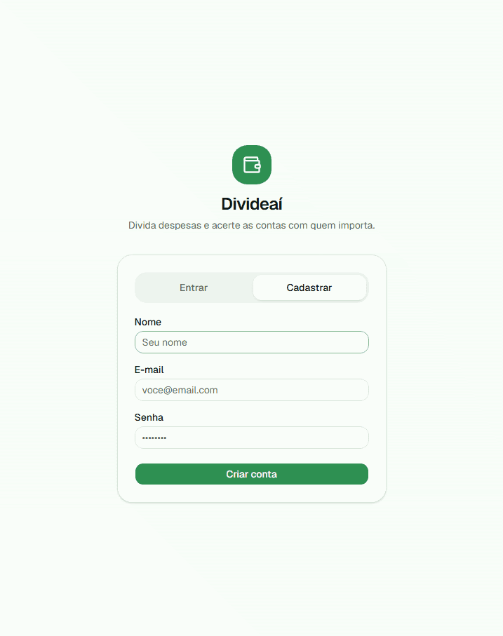
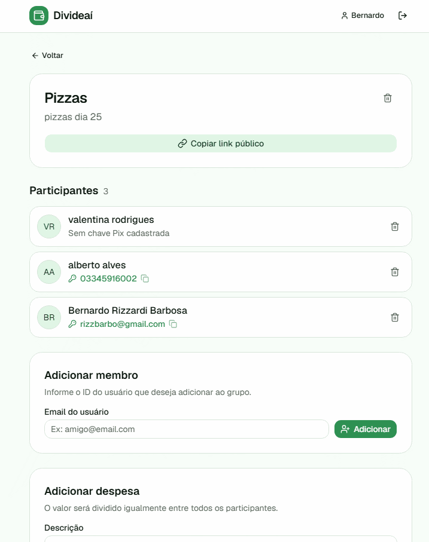
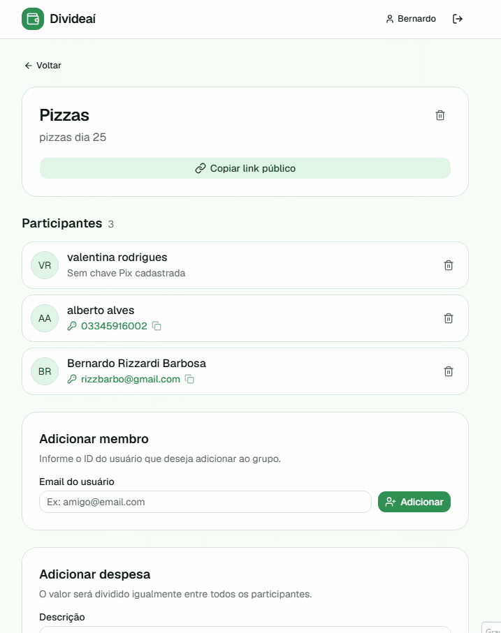

# DivideAí

## 1. Identificação

| | |
|---|---|
| **Alunos** | Bernardo Rizzardi Barbosa e Alberto Alves Junior |
| **Curso** | Sistemas de Informação |

---

## 2. Proposta

O **DivideAí** é uma plataforma web para divisão de gastos em grupo. Através dela, grupos de pessoas podem registrar despesas compartilhadas, visualizar quanto cada participante deve, e saber exatamente quem deve pagar para quem — simplificando o acerto de contas em repúblicas, viagens e eventos.

---

## 3. Processo de Desenvolvimento

### Arquitetura

- **Controller** — recebe as requisições HTTP e devolve respostas
- **Service** — aplica as regras de negócio
- **Repository** — executa o SQL e persiste os dados
- **Model** — representa as entidades do domínio
- **DTO** — transfere dados entre as camadas e a API

### Divisão de trabalho

**Alberto** foi responsável por:
- `UsuarioRepository`, `UsuarioService`, `UsuarioController`
- `GrupoRepository`, `GrupoService`, `GrupoController`

O maior aprendizado foi entender na prática como integrar o banco de dados com o backend, estruturando o sistema do zero com Orientação a Objetos no Java. Além disso, ficou clara a importância da arquitetura em camadas (Controller, Service e Repository) para não misturar as regras de negócio com o banco de dados ou com as requisições HTTP.

**Bernardo** foi responsável por:
- `DespesaRepository`, `DespesaService`, `SaldoService`, `DespesaController`

Aprendeu as dependências entre arquivos em um backend de desenvolvimento web, programar em java e como lidar com classes e objetos na linguagem.

### Dificuldades e soluções (Bernardo)

**SQL e JDBC** — Como eu não tinha experiência com banco de dados, tive que entender desde o básico de SELECT e INSERT. A parte mais difícil foi entender como usar isso no Java usando PreparedStatement e ter que gerenciar as transações na mão com setAutoCommit(false) para não dar erro no banco.

**Divisão igualitária com centavos** — Encontrei um problema: dividir R$ 100,00 por 3 pessoas. A conta não fecha e alguém ia perder um centavo. A saída que implementei foi forçar o arredondamento para baixo (RoundingMode.DOWN), deixando R$ 33,33 para cada um, e pegar o R$ 0,01 que sobrava e adicionar no saldo do primeiro da lista. Assim o valor da despesa bateu exato.

**BigDecimal** — Foi complicado me acostumar com o BigDecimal no lugar do double. Como a classe é imutável, eu tentava somar os valores com .add() e não funcionava, até entender que precisava reatribuir o objeto. Também apanhei um pouco para lembrar de usar .compareTo() em vez de .equals() nas comparações de valores.

**Desenvolvimento web do zero** — Tenho uma base muito fraca em desenvolvimento web. O maior desafio inicial foi entender o fluxo da informação: visualizar como o JSON sai do front, bate no Controller, passa pela regra de negócio no Service, vai pro Repository e depois volta. Entender isso tomou um bom tempo.

### Dificuldades e soluções (Alberto)

**Modelagem e Orientação a Objetos** — Tirar o problema do papel e transformar em classes no Java foi um desafio. O ponto crítico foi fazer as entidades se relacionarem. Na prática, tive que usar o conceito de composição no Java para conseguir vincular os usuários aos grupos. Como a gente precisava carregar os membros de um grupo sob demanda, apanhei um pouco para conseguir fazer essa ligação usando a tabela associativa (grupo_usuario) e puxar isso com JOINs.

**Relacionamento Muitos-para-Muitos (JDBC)** — A lógica do SQL na tabela associativa até fez sentido rápido, mas o problema real foi tratar isso no Java. Como um usuário pode estar em vários grupos e um grupo tem vários usuários, mapear isso no JDBC puro foi bem chato. Pegar o retorno do ResultSet misturado com os JOINs e conseguir montar as listas de objetos certinhas em memória deu um pequeno trabalho.

**Separação de Responsabilidades e Regras de Negócio** — No começo, era difícil entender a divisão entre frontend, backend e banco. Na prática, meu maior aprendizado foi separar as responsabilidades dentro do código. Percebi que validações importantes, como verificar se um e-mail já estava cadastrado antes de criar um Usuario, não deveriam ficar espalhadas. Eu tive que focar em isolar essas regras puramente na camada Service, deixando o Controller apenas para as rotas HTTP e o Repository apenas para os comandos SQL.

---

## 4. Diagrama de Classes



Diagrama gerado com LucidChart

---

## 5. Orientações para Execução

### Pré-requisitos

- Java 21
- Maven 3.8+
- PostgreSQL 15+

### Configuração do banco de dados

```bash
# Acesse o PostgreSQL
sudo -u postgres psql

# Crie o banco
CREATE DATABASE divideai;
\q

# Execute o schema
sudo -u postgres psql -d divideai -f src/main/resources/schema.sql

# (Opcional) Dados de teste
sudo -u postgres psql -d divideai -f src/main/resources/dados_teste.sql
```

### Variáveis de ambiente

Crie um arquivo `.env` na raiz do projeto:

```
DB_URL=jdbc:postgresql://localhost:5432/divideai
DB_USER=postgres
DB_PASS=postgres
```

### Executando

```bash
# Clone o repositório
git clone https://github.com/elc117/final-2026a-albertoebernardor.git
cd final-2026a-albertoebernardor/divideai

# Instale as dependências
mvn dependency:resolve

# Execute
mvn exec:java
```

### Versão online

A aplicação está disponível em: [front-divideai.onrender.com](https://front-divideai.onrender.com)

---

## 6. Resultado Final

### Cadastro de usuario



### Adiciona despesa no grupo



### Compartilha grupo de despesas sem necessidade de login



---

## 7. Referências e Créditos

### Ferramentas utilizadas

- **[Claude (Anthropic)](https://claude.ai)** — auxílio no desenvolvimento do backend e correção de bugs. Alguns prompts utilizados:
  - *"Como funciona um PreparedStatement em Java?"*
  - *"Como tratar a divisão igualitária com resto de centavos usando BigDecimal?"*

- **[v0 (Vercel)](https://v0.dev)** — desenvolvimento inicial do frontend

- **[Claude Opus 4.6](https://claude.ai)** — correção de bugs no frontend

- **[Render](https://render.com)** — deploy do backend e do banco de dados PostgreSQL

### Referências técnicas

- [Documentação do Javalin](https://javalin.io/documentation)
- [Documentação do PostgreSQL](https://www.postgresql.org/docs/)
- [Java BigDecimal — documentação oficial](https://docs.oracle.com/en/java/docs/api/java.base/java/math/BigDecimal.html)
